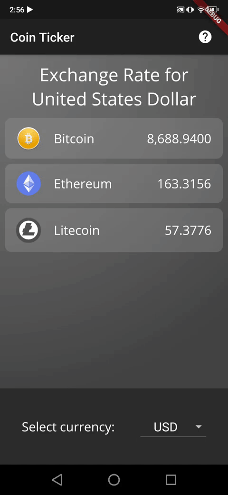

# Bitcoin Ticker 🤑

Bitcoin Ticker Project from the Complete Flutter Development Bootcamp https://www.appbrewery.co, with customization.

Fetches real-time cryptocurrency conversion for multiple currencies using [BitcoinAverage](https://bitcoinaverage.com/)'s API.

## Customization

The following is my implementation.

- Added pull-to-refresh functionality
- Created reusable CardCoin component
- Added details screen
- Added help icon in appbar (shows help dialog)
- Added "loading circle" when fetching new data
- Revamped design
- Created gradient background

## Packages used
- [http](https://pub.dev/packages/http)
- [intl](https://pub.dev/packages/intl)
- [flutter_spinkit](https://pub.dev/packages/flutter_spinkit)
